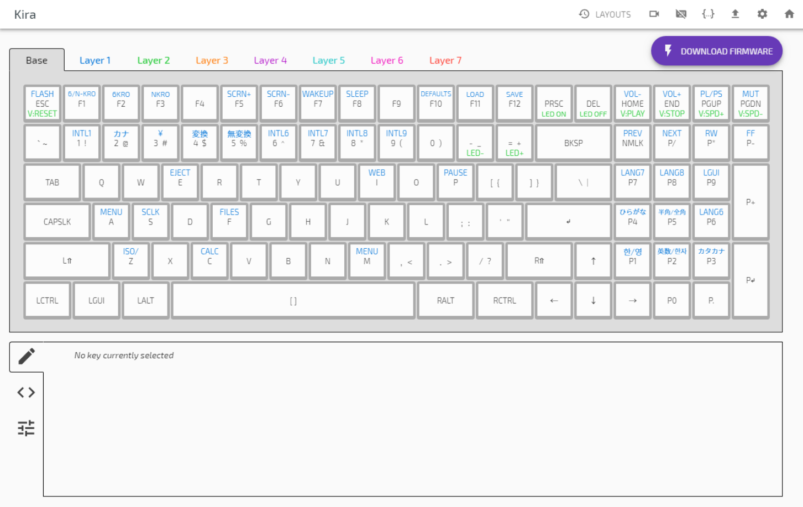

# Download the configurator

<!-- tabs:start -->

#### ** Windows **

v1.0.0 **NEW**: [Download Windows Configurator](https://github.com/kiibohd/configurator/releases/download/v1.0.0/kiibohd-configurator-1.0.0-win.exe)

 - Kira support
 - Macro support

?> If you have issues with your keyboard being detected, please try the following package:
   [Windows Driver Installer](https://github.com/kiibohd/kiidrv/releases/download/v1.5.3-kiidrv/KiibohdDrivers.msi)

<!--
---
Old Versions:

*v0.4.1:* [Download](https://github.com/kiibohd/configurator/releases/download/v0.4.1/kiibohd-configurator-0.4.1-win.exe)

 - K-Type animation support

 - Requires [dfu-util](http://dfu-util.sourceforge.net/releases/)
-->

#### ** Mac **

v1.0.0 **NEW**: [Download OSX installer](https://github.com/kiibohd/configurator/releases/download/v1.0.0/kiibohd-configurator-1.0.0-mac.dmg)

 - Kira support
 - Macro support

<!--
---
Old Versions:

v0.4.1: [Download](https://github.com/kiibohd/configurator/releases/download/v0.4.1/kiibohd-configurator-0.4.1-mac.dmg)

 - K-Type animation support

 - Requires dfu-util (available using [homebrew](https://brew.sh/), `brew install dfu-util`)
-->

#### ** Debian, Ubuntu, Mint **

v1.0.0 **NEW**:
 - [Download and run AppImage](https://github.com/kiibohd/configurator/releases/download/v0.4.1/kiibohd-configurator-0.4.1.tar.g://github.com/kiibohd/configurator/releases/download/v1.0.0/kiibohd-configurator-1.0.0-linux-x86_64.AppImage)
 - `sudo apt-get install dfu-util`

#### ** Fedora **

v1.0.0 **NEW**:
 - [Download and run AppImage](https://github.com/kiibohd/configurator/releases/download/v0.4.1/kiibohd-configurator-0.4.1.tar.g://github.com/kiibohd/configurator/releases/download/v1.0.0/kiibohd-configurator-1.0.0-linux-x86_64.AppImage)
 - `sudo dnf install dfu-util`

#### ** Arch **

v1.0.0 **NEW**:
 - `pacman -S dfu-util`
 - [Download AppImage](https://github.com/kiibohd/configurator/releases/download/v0.4.1/kiibohd-configurator-0.4.1.tar.g://github.com/kiibohd/configurator/releases/download/v1.0.0/kiibohd-configurator-1.0.0-linux-x86_64.AppImage)
 - `chmod +x kiibohd-configurator-1.0.0-linux-x86_64.AppImage`
 - `./kiibohd-configurator-1.0.0-linux-x86_64.AppImage`

#### ** Other Linux **

v1.0.0 **NEW**:
 - Install [dfu-util](http://dfu-util.sourceforge.net) using your systems package manager
 - [Download tar](https://github.com/kiibohd/configurator/releases/download/v1.0.0/kiibohd-configurator-1.0.0-linux-x64.tar.gz)
 - Run `kiibohd-configurator`

<!-- tabs:end -->

Other releases are available on github: [Browse all](https://github.com/kiibohd/configurator/releases)

# Choose your device

# Configure your Layout

Keys can be reassigned by clicking a switch and then clicking an action below. For more information see the [Keys](Configurator/Keys.md) page.

# Applying your changes

Press the lightning bolt icon at the top right of the toolbar.

Once the download is complete you should see a green success message

### Entering Flash Mode.

1.  Flip your Keyboard over.
2.  With the keys down you should see a small hole on the the buttom of the board.
3.  While the keyboard is plugged in, use a paperclip or other small object to press the button inside the case.

- TIP: you can also configure a key combination to enter flash mode.

<!-- tabs:start -->

## ** Kira **

## ** WhiteFox / Nightfox **

#### Video

## ** K-Type **

#### Video

<!-- tabs:end -->

#### Failsafe mode

In case the keyboard cannot load the flashed firmware it will go into failsafe mode. In this state the keyboard is unresponsive, but can still enter flash mode.

### Flashing

Once in flash mode, the red (no keyboard is in flash mode) text should dissapear.
You can then press the purple flash button.

#### Exiting Flash Mode

The keyboard exists flash mode automatically after a successful flash.

If you do not wish to change the firmware you may press <kbd>ESC</kbd> or unplug the keyboard to exit flash mode manually.

# Done

Enjoy your new layout. For more advanced features and configuration please see the [Configurator](Configurator.md#customization) section of this wiki.
