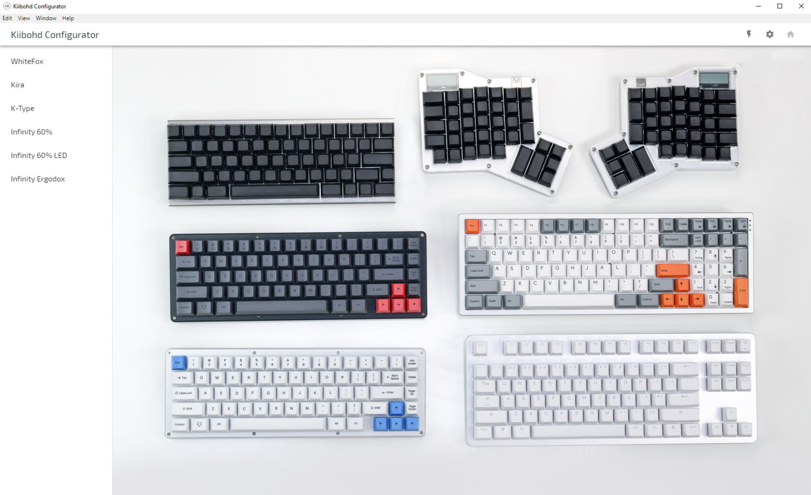
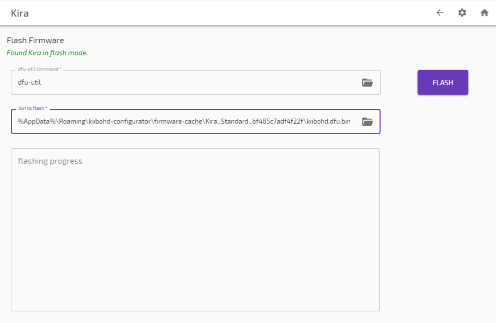

# Download the configurator

?> The latest pre-release contains support for Kira, but is not yet feature complete.
Please check back often for future updates.
[Download v0.6.0-alpha](https://github.com/kiibohd/configurator/releases/tag/v0.6.0-alpha)

The current stable release is available at https://github.com/kiibohd/configurator/releases/latest.

<!-- tabs:start -->

#### ** Windows **

Download kiibohd-configurator-XXXXX-win.exe

#### ** Mac **

- Download kiibohd-configurator-XXXXX-mac.dmg
- Install [dfu-util](http://dfu-util.sourceforge.net/releases/) using [homebrew](https://brew.sh/) - `brew install dfu-util`

#### ** Debian, Ubuntu, Mint **

- Download kiibohd-configurator-XXXXX-linux-YYYY.deb
- `sudo apt-get install dfu-util`

#### ** Fedora **

- Download kiibohd-configurator-XXXXX.tar.gz
- `sudo dnf install dfu-util`

#### ** Arch **

- Download kiibohd-configurator-XXXXX.tar.gz
- `pacman -S dfu-util`

#### ** Other Linux **

- Download kiibohd-configurator-XXXXX.tar.gz
- Using your system package manager install [dfu-util](http://dfu-util.sourceforge.net/releases/)

<!-- tabs:end -->

# Choose your device

## Official Input Club Keyboards

- [Infinity 60%](https://input.club/devices/infinity-keyboard/)
- [Infinity 60% LED](https://input.club/devices/infinity-keyboard/)
- [Infinity Ergodox](https://input.club/devices/infinity-ergodox/)
- [K-Type](https://input.club/k-type/)
- [WhiteFox](https://input.club/whitefox/)

## Other Keyboards

3rd party keyboards are not currently supported in the configurator.
For manually porting to new keyboards see the [Development](Development.md) section.

# Configure your Layout

Keys can be reassigned by clicking a switch and then clicking an action below. For more information see the [Customization](Customization.md) setction.

# Applying your changes

Press the lightning bolt icon at the top right of the toolbar.

Once the download is complete you should see a green success message

### Entering Flash Mode.

1.  Flip your Keyboard over.
2.  With the keys down you should see a small hole on the the buttom of the board.
3.  While the keyboard is plugged in, use a paperclip or other small object to press the button inside the case.

- TIP: you can also configure a key combination to enter flash mode.

<!-- tabs:start -->

## ** Kira **

## ** WhiteFox / Nightfox **

#### Video

## ** K-Type **

#### Video

<!-- tabs:end -->

#### Failsafe mode

In case the keyboard cannot load the flashed firmware it will go into failsafe mode. In this state the keyboard is unresponsive, but can still enter flash mode:

1. Unplug an replug the USB cable
2. Press the flash button (as described above) twice in a row

### Flashing

Once in flash mode, the red (no keyboard is in flash mode) text should dissapear.
You can then press the purple flash button.

#### Exiting Flash Mode

The keyboard exists flash mode automatically after a successful flash.

If you do not wish to change the firmware you may press <kbd>ESC</kbd> or unplug the keyboard to exit flash mode manually.

# Done

Enjoy your new layout. For more advanced features and configuration please see the Configurator section of this wiki.
